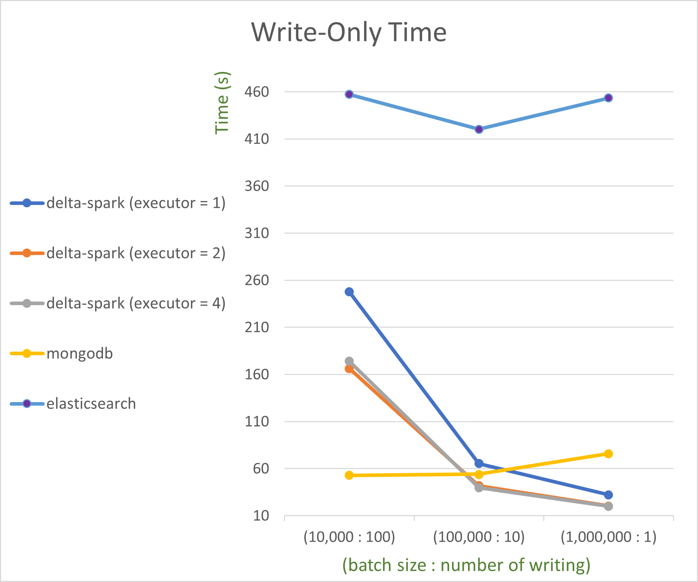
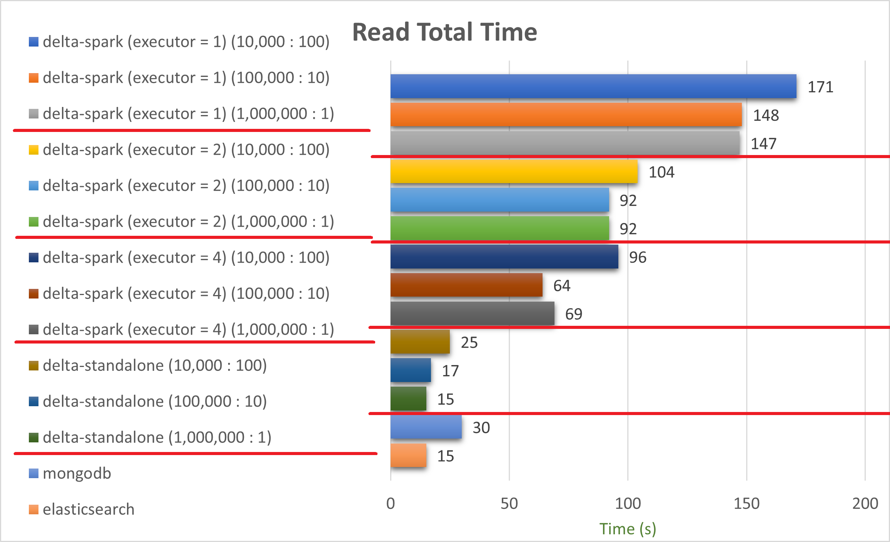

# cloud-internship
# Delta-spark, MongoDB, Elasticsearch Write-Read Performance Test

## Environment

* Kubernetes
  - Model: LenovoM90q G2-11MQS007700
  - CPU: 8/16
  - Memory: 16GB
  - SSD: 256GB + 512GB
  - EA: 3

&nbsp;
## Method of Measurement

### Step 1
Save a csv file having 50 fields and 1 million rows to Minio.

&nbsp;
### Step 2
Measure elapsed time and memory usage of writing data of the csv file with Delta-spark to Minio,
and also measure the time and memory of writing data to MongoDB and Elasticsearch.

- There are 3 different method of writing.
  * Write every 10,000 rows
  * Write every 100,000 rows
  * Write all at once

- Measuring
  * Write-Only Time
  * Write Total Time (Pod Running ~ Completed)
  * Memory Usage

&nbsp;
### Step 3
Measure elapsed time and memory usage of reading data saved by Delta-spark or saved in MongoDB and Elasticsearch.
In case of reading delta table, performance of delta-standalone was also tested.

- Measuring
  * Read-Only Time
  * Read Total Time (Pod Running ~ Completed)
  * Memory Usage

&nbsp;
## Chart of Result

1. Write

&nbsp;
2. Read

