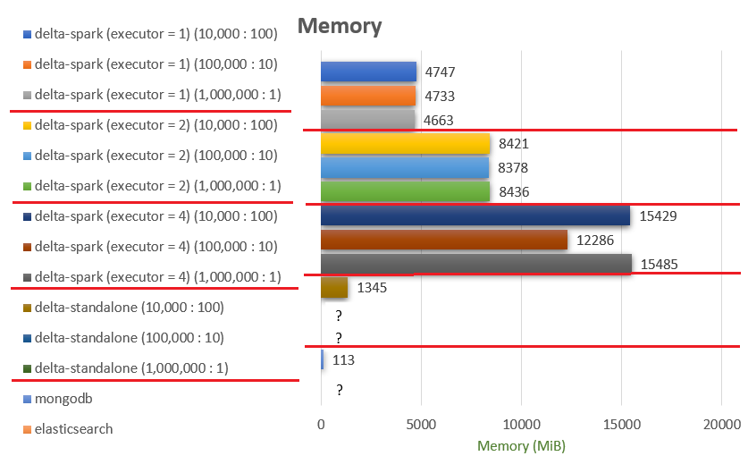

# cloud-internship
# Delta-spark, MongoDB, Elasticsearch Write-Read Performance Test

## Environment

* Kubernetes
  - Version: 1.24.1
  - Model: LenovoM90q G2-11MQS007700
  - CPU: 8/16
  - Memory: 16GB
  - SSD: 256GB + 512GB
  - EA: 3
* Delta-Spark
  - delta-spark version: 1.2.0
  - pyspark version: 3.2.1
* Mongodb
  - Version: 5.0.7-6
  - Memory:
  - cfg: 3
  - Replicaset: 3
  - mongos: 2
* Elasticsearch
  - Version: 8.2.0
  - Memory request: 2Gi
  - Memory limit: 2Gi
  - Replicas: 3

&nbsp;
## Method of Measurement

### Step 1
Save a csv file having 50 fields and 1 million rows to Minio.

&nbsp;
### Step 2
Measure elapsed time and memory usage of writing data of the csv file with Delta-spark to Minio,
and also measure the time and memory of writing data to MongoDB and Elasticsearch.

- There are 3 different method of writing.
  * Write every 10,000 rows
  * Write every 100,000 rows
  * Write all at once

- Measuring
  * Write-Only Time
  * Write Total Time (Pod Running ~ Completed)
  * Memory Usage

- Library and Functions
  * delta-spark

   1. Write every 10,000 rows or 100,000 rows
   ```
   from pyspark.sql import SparkSession
   from pyspark.context import SparkContext
   import pandas as pd
   from smart_open import open
   from delta import *
   import boto3
   
   ... 
   
   data = dict(zip(header, list(zip(*rows))))
   df = spark.createDataFrame(pd.DataFrame(data))
   df.write.format('delta').mode('append').save('s3a://delta/test/')
   ```
   
   2. Write all at once
   ```
   from pyspark.sql import SparkSession
   from pyspark.context import SparkContext
   from delta import *
   
   ...
   
   df = spark.read.options(header=True, inferSchema=True).format("csv").load('s3a://test/test.csv')
   df.write.format('delta').mode("overwrite").option("overwriteSchema", "True").save('s3a://delta/loadsavetest/')
   ```
   
  * mongodb

   1. Write every 10,000 rows or 100,000 rows
   ```
   from pymongo import MongoClient
   from smart_open import open
   
   ...
   
   data = []
   # Read 10,000 rows and write
   for _ in range(10000):
       row = fin.readline().rstrip()
       if row == '':
           break
       data.append(dict(zip(header, row.split(','))))
       
   collection.insert_many(data)
   ```
   
   2. Write all at once
   ```
   from pymongo import MongoClient
   from smart_open import open
   
   ...
   
   data = csv.DictReader(fin)
   collection.insert_many(data)
   ```
   
  * elasticsearch
   1. Write every 10,000 rows or 100,000 rows
   ```
   from elasticsearch import helpers, Elasticsearch
   from smart_open import open
   
   ...
   data = []
   # Read 10000 rows and write
   for _ in range(10000):
       row = fin.readline().rstrip()  
       if row == '':
           break
       data.append(dict(zip(header, row.split(','))))
   helpers.bulk(es, data, index=target_index)
   ```
   2. Write all at once
   ```
   from elasticsearch import helpers, Elasticsearch
   from smart_open import open
   
   ...
   
   data = csv.DictReader(fin)
   helpers.bulk(es, data, index=target_index)
   ```

&nbsp;
### Step 3
Measure elapsed time and memory usage of reading data saved by Delta-spark or saved in MongoDB and Elasticsearch.
In case of reading delta table, performance of delta-standalone was also tested.

- Measuring
  * Read-Only Time
  * Read Total Time (Pod Running ~ Completed)
  * Memory Usage

- Library and Functions
  * delta-spark
   ```
   from pyspark.sql import SparkSession
   from pyspark.context import SparkContext
   from delta import *
   
   ...
   
   df = spark.read.format("delta").load('s3a://delta/test')
   def f(row):
       pass
   df.foreach(f) # reading data one by one
   ```
   
  * delta-standalone (Java)
   ```
   import io.delta.standalone.DeltaLog;
   import io.delta.standalone.data.CloseableIterator;
   import io.delta.standalone.data.RowRecord;
   
   ...
   
   // reading data one by one
   while(dataIter.hasNext()) { RowRecord temp = (RowRecord)dataIter.next(); }
   ```
   
  * mongodb
   ```
   from pymongo import MongoClient
   
   ...
   
   cursor = collection.find()
   for doc in cursor: # reading data one by one
       pass
   ```
   
  * elasticsearch
   ```
   from elasticsearch import Elasticsearch
   
   ...
   
   while True:
        # reading 10,000 data repeatedly
        resp = es.search(size=10000, query=my_query, pit=pit_clause, sort=sort_clause, search_after=search_after_clause)
    
        if resp['hits']['hits'] == []:
            break
   ```

&nbsp;
## Chart of Result

1. Write


&nbsp;
2. Read




## Conclusion

...
