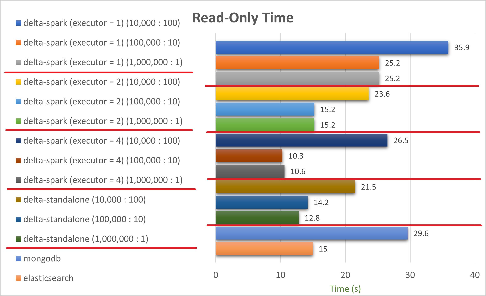

# cloud-internship
# Delta-spark, MongoDB, Elasticsearch Write-Read Performance Test

## Environment

* Kubernetes
  - Version: 1.24.1
  - Model: LenovoM90q G2-11MQS007700
  - CPU: 8/16
  - Memory: 16GB
  - SSD: 256GB + 512GB
  - EA: 3
* Delta-Spark
  - delta-spark version: 1.2.0
  - pyspark version: 3.2.1
  - spark.driver.memory: 2g
  - spark.executor.instance: 1, 2, 4
  - spark.executor.cores: 1
  - spark.executor.memory: 4g
* Mongodb
  - Version: 5.0.7-6
  - Memory: unlimited
  - cfg: 3
  - Replicaset: 3
  - mongos: 2
* Elasticsearch
  - Version: 8.2.0
  - Memory request: 2Gi
  - Memory limit: 2Gi
  - Replicas: 3

&nbsp;
## Method of Measurement

### Step 1
Save a csv file having 50 fields and 1 million rows to Minio.

&nbsp;
### Step 2
Measure elapsed time and memory usage of writing data of the csv file with Delta-spark to Minio,
and also measure the time and memory of writing data to MongoDB and Elasticsearch.

- There are 3 different method of writing.
  * Write every 10,000 rows
  * Write every 100,000 rows
  * Write all at once

- Measuring
  * Write-Only Time
  * Write Total Time (Pod Running ~ Completed)
  * Memory Usage

- Library and Functions
  * delta-spark

   1. Write every 10,000 rows or 100,000 rows
   ```
   ...
   df = spark.createDataFrame(pd.DataFrame(data))  # pd=pandas, data=dict saving 10,000 rows
   df.write.format('delta').mode('append').save('s3a://delta/test/')
   ```
   
   2. Write all at once
   ```
   ...
   df = spark.read.options(header=True, inferSchema=True).format("csv").load('s3a://test/test.csv')
   df.write.format('delta').mode("overwrite").option("overwriteSchema", "True").save('s3a://delta/loadsavetest/')
   ```
   
  * mongodb

   1. Write every 10,000 rows or 100,000 rows
   ```
   ...
   for _ in range(10000):
       ##########################################
       # read 10,000 rows and save them to data #
       ##########################################
   collection.insert_many(data)
   ```
   
   2. Write all at once
   ```
   from smart_open import open
   ...
   data = csv.DictReader(fin)   # fin is a file-like object
   collection.insert_many(data)
   ```
   
  * elasticsearch
   1. Write every 10,000 rows or 100,000 rows
   ```
   ...
   for _ in range(10000):
       ##########################################
       # read 10,000 rows and save them to data #
       ##########################################
   helpers.bulk(es, data, index=target_index)
   ```
   2. Write all at once
   ```
   from smart_open import open
   ...   
   data = csv.DictReader(fin)   # fin is a file-like object
   helpers.bulk(es, data, index=target_index)
   ```

&nbsp;
### Step 3
Measure elapsed time and memory usage of reading data saved by Delta-spark or saved in MongoDB and Elasticsearch.
In case of reading delta table, performance of delta-standalone was also tested.

- Measuring
  * Read-Only Time
  * Read Total Time (Pod Running ~ Completed)
  * Memory Usage

- Library and Functions
  * delta-spark
   ```
   ...   
   df = spark.read.format("delta").load('s3a://delta/test')
   df.foreach(f) # reading data one by one, f is a function doing nothing
   ```
   
  * delta-standalone (Java)
   ```
   import io.delta.standalone.DeltaLog;
   import io.delta.standalone.data.CloseableIterator;
   import io.delta.standalone.data.RowRecord;
   ...
   while(dataIter.hasNext()) { RowRecord temp = (RowRecord)dataIter.next(); }   // reading data one by one
   ```
   
  * mongodb
   ```
   ...
   cursor = collection.find()
   for doc in cursor:   # reading data one by one
       pass
   ```
   
  * elasticsearch
   ```
   ...  
   while True:
        # reading 10,000 data repeatedly
        resp = es.search(size=10000, query=my_query, pit=pit_clause, sort=sort_clause, search_after=search_after_clause)
        ...
   ```

&nbsp;
## Chart of Result

1. Write


&nbsp;
2. Read




## Conclusion

1. Write
   - delta-spark는 batch size가 클수록, executor 수가 많을수록 소요시간이 짧아지는 경향이 있다.
   - mongodb는 batch size가 작을 경우 속도가 빠르지만, batch size가 커지면 delta-spark에 역전될 수 있다.
   - elasticsearch는 write 속도가 매우 느리다

2. Read
   - delta-spark의 경우, batch size와 executor instance에 따른 소요시간의 경향성이 보이지 않는다. Workload에 따라 batch size와 executor instance를 조율하는 것이 필요하다. 
   - delta-standalone이 delta-spark보다 항상 빠른 것은 아니다.
   - elasticsearch는 write 속도가 매우 느렸지만, mongodb의 read 속도보다 약 2배 빠른 read 속도를 보인다.

3. Memory
   - delta-spark는 executor instance가 클수록 메모리를 많이 사용한다.
   - mongodb는 write의 batch size가 클수록 메모리 사용량이 증가한다.
   - elasticsearch는 메모리 사용량이 가장 적다.
   - 모든 데이터를 한 번에 쓰는 경우(batch size=1,000,000 : number of writing=1), 코드 구현이 Iterator 또는 cursor를 이용해서 csv를 읽는 동시에 write 하기 때문에 메모리 사용량이 적다.
